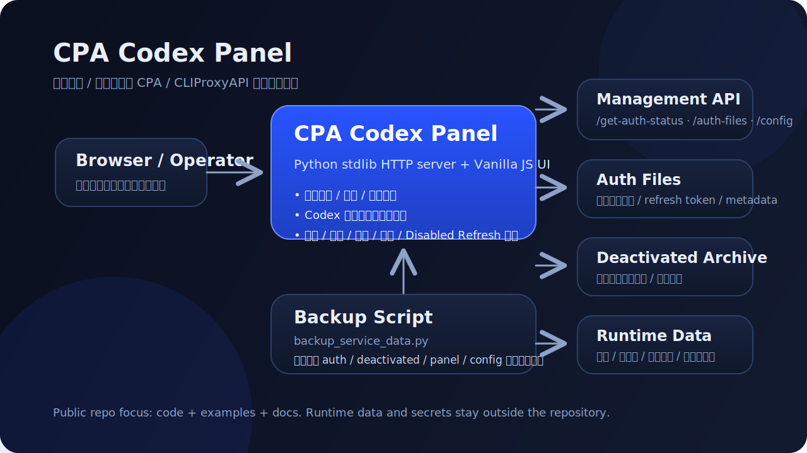
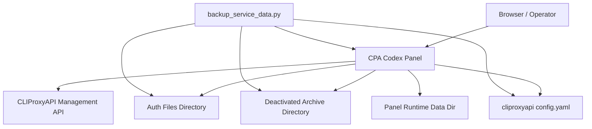

# CPA Codex Panel

> A lightweight web operations panel for CPA / CLIProxyAPI Codex accounts.


`cpa-codex-panel` 是一个面向**运营 / 运维场景**的 Web 面板，用来在 `CPA / CLIProxyAPI` 之上统一查看账号状态、刷新 Codex 额度、执行批量恢复，并维护分组、标签、负责人、备注、星标等业务元数据。



> [!IMPORTANT]
> 这不是一个独立账号系统，也不是 `cli-proxy-api` 的替代品。
> 
> 它依赖底层 CPA / CLIProxyAPI 服务，通过 **Management API**、**auth 文件目录**、**停用归档目录** 与相关配置文件来工作。

---

## 为什么这个仓库适合公开展示

这个项目的定位很明确：

- **上层运营面板**：聚焦账号可视化、批量操作和运维观测
- **依赖边界清晰**：把底层 CPA / CLIProxyAPI 当作上游能力，不混在一起
- **部署可复用**：仓库内保留代码、示例配置、systemd / Nginx 示例
- **运行态外置**：支持把真实运行数据、会话、密钥与备份放在仓库外
- **技术栈轻量**：后端基本基于 Python 标准库，前端为原生 HTML / CSS / JS

如果你已经有一套 CPA / CLIProxyAPI 服务，但缺少一个适合运营同学或运维同学使用的界面，这个项目就是补上这层能力。

---

## 核心能力

### 1) 账号列表与筛选
- 统一展示 active / disabled / deactivated / expired / expiring_soon 等状态
- 支持搜索邮箱、文件名、账号 ID、auth index、模型、分组、备注
- 支持状态筛选、额度异常筛选、分组筛选、分页
- 支持星标、标签、负责人、备注等业务元数据

### 2) 单账号操作
- 查看账号详情
- 切换启用 / 停用状态
- 刷新 Codex 额度
- 编辑分组、标签、备注、负责人、星标
- 仅对允许删除的迁移停用账号执行删除

### 3) 批量操作
- 批量启用禁用账号
- 批量检查额度并自动恢复可恢复账号
- 批量删除可删除账号
- 一键清空全部迁移停用账号
- 打包下载异常账号 JSON

### 4) Disabled Refresh 观测
- 独立 tab 展示 disabled refresh 状态
- 支持手动执行一轮检查
- 支持下载最近一次结果 JSON
- 展示 blocked / skipped / failed 的摘要与样本
- 对 legacy disabled 账号保留兼容观测逻辑

### 5) 发布与运维友好
- `.env.example` 按职责分组
- `deploy/systemd/*.example` 可直接作为部署模板
- `deploy/nginx/*.example` 提供反代示例
- `backup_service_data.py` 提供关键目录备份能力

---

## 架构与依赖边界



### 这意味着什么

- 账号真实来源不是面板数据库，而是**上游 Management API + 本地账号文件**
- 面板本身主要负责：**聚合、展示、操作、元数据补充、运维观测**
- 面板的业务元数据和会话数据可以放到单独数据目录中，不污染代码仓库

---

## 仓库结构

```text
cpa-codex-panel/
├── app.py
├── backup_service_data.py
├── README.md
├── requirements.txt
├── .env.example
├── .gitignore
├── assets/
│   └── architecture-overview.svg
├── docs/
│   └── repository-presentation.md
├── static/
│   ├── index.html
│   ├── app.js
│   └── styles.css
├── tests/
│   └── test_panel_compat.py
└── deploy/
    ├── nginx/
    │   └── cpa-codex-panel.nginx.conf.example
    └── systemd/
        ├── cpa-codex-panel.service.example
        ├── cpa-file-backup.service.example
        └── cpa-file-backup.timer.example
```

---

## 快速启动

### 1. 安装依赖

```bash
cd /opt/cpa-codex-panel
python3 -m pip install -r requirements.txt
```

### 2. 准备配置与运行目录

```bash
sudo mkdir -p /etc/cpa-codex-panel /var/lib/cpa-codex-panel
sudo cp .env.example /etc/cpa-codex-panel/panel.env
```

### 3. 编辑配置

至少需要填写这些关键项：

```env
CPA_PANEL_TOKEN=replace-with-your-admin-token
CPA_MANAGEMENT_BASE_URL=http://127.0.0.1:18317
CPA_MANAGEMENT_KEY=replace-with-your-management-key
CPA_PANEL_AUTH_DIR=/path/to/auth-dir
CPA_PANEL_DEACTIVATED_DIR=/path/to/deactivated-dir
CPA_PANEL_CLIPROXY_CONFIG=/path/to/cliproxyapi/config.yaml
CPA_PANEL_DATA_DIR=/var/lib/cpa-codex-panel
```

### 4. 启动面板

```bash
cd /opt/cpa-codex-panel
CPA_PANEL_ENV_FILE=/etc/cpa-codex-panel/panel.env python3 app.py
```

默认访问地址：

```text
http://127.0.0.1:18660
```

> [!TIP]
> 如果未设置 `CPA_PANEL_TOKEN`，程序会临时生成一个管理员口令并打印到标准输出。
> 这适合临时测试，不适合生产环境。

---

## 配置模型

项目刻意把配置分成 4 组，方便发布、迁移与运维。

### 面板自身配置

```env
CPA_PANEL_HOST=127.0.0.1
CPA_PANEL_PORT=18660
CPA_PANEL_TOKEN=replace-with-your-admin-token
CPA_PANEL_CACHE_SECONDS=20
CPA_PANEL_SESSION_TTL_MINUTES=420
```

### 上游依赖配置

```env
CPA_MANAGEMENT_BASE_URL=http://127.0.0.1:18317
CPA_MANAGEMENT_KEY=replace-with-your-management-key
CPA_MANAGEMENT_TIMEOUT_SECONDS=12
CPA_PANEL_AUTH_DIR=/path/to/auth-dir
CPA_PANEL_DEACTIVATED_DIR=/path/to/deactivated-dir
CPA_PANEL_CLIPROXY_CONFIG=/path/to/cliproxyapi/config.yaml
```

## 运行数据与备份

### 面板运行数据配置

```env
CPA_PANEL_DATA_DIR=/var/lib/cpa-codex-panel
CPA_PANEL_META_PATH=/var/lib/cpa-codex-panel/account_meta.json
CPA_PANEL_SESSION_STORE_PATH=/var/lib/cpa-codex-panel/sessions.json
```

如果没有显式指定 `CPA_PANEL_META_PATH` 和 `CPA_PANEL_SESSION_STORE_PATH`，程序会基于 `CPA_PANEL_DATA_DIR` 自动推导默认路径。

### Disabled Refresh 与备份配置

```env
CPA_PANEL_MANUAL_DISABLED_REFRESH_ENABLED=false
CPA_PANEL_MANUAL_DISABLED_REFRESH_INTERVAL_SECONDS=900
CPA_PANEL_MANUAL_DISABLED_REFRESH_BATCH_SIZE=50
CPA_PANEL_MANUAL_DISABLED_REFRESH_STARTUP_DELAY_SECONDS=45

CPA_BACKUP_DIR=/var/backups/cpa-service
CPA_BACKUP_RETENTION_DAYS=14
```

---

## Disabled Refresh 机制说明

这个项目的一个重点能力是：

- 对“手动停用”的账号进行定时额度检查
- 在满足恢复条件时自动恢复启用
- 对 legacy disabled 账号保留兼容观测，而不是盲目自动恢复

当前实现中：

- 自动恢复只允许作用于带 `manual_disabled` 标记的账号
- 对 legacy disabled 账号可以纳入观测，但不会直接被自动恢复
- 需要连续成功达到阈值后，才会触发自动恢复

这使得它更适合真实生产环境，而不是简单地“检测到正常就立刻恢复”。

---

## API 概览

当前 Web 面板对前端暴露的主要接口包括：

### 鉴权与刷新
- `POST /api/login`
- `POST /api/logout`
- `POST /api/refresh`

### 总览与列表
- `GET /api/overview`
- `GET /api/accounts`
- `GET /api/accounts/{key}`

### 单账号操作
- `POST /api/accounts/{key}/status`
- `POST /api/accounts/{key}/quota-refresh`
- `PATCH /api/accounts/{key}/meta`
- `DELETE /api/accounts/{key}`

### 批量操作
- `POST /api/accounts/batch-status`
- `POST /api/accounts/batch-refresh-recover`
- `POST /api/accounts/batch-delete`
- `POST /api/accounts/delete-all-deactivated`
- `POST /api/accounts/export-disabled-unrefreshed`

### Disabled Refresh 观测
- `POST /api/disabled-refresh/run`
- `GET /api/disabled-refresh/latest-result`

---

## 部署示例

仓库已内置部署模板：

- systemd service: `deploy/systemd/cpa-codex-panel.service.example`
- backup service: `deploy/systemd/cpa-file-backup.service.example`
- backup timer: `deploy/systemd/cpa-file-backup.timer.example`
- Nginx reverse proxy: `deploy/nginx/cpa-codex-panel.nginx.conf.example`

### systemd

```bash
sudo cp deploy/systemd/cpa-codex-panel.service.example /etc/systemd/system/cpa-codex-panel.service
sudo cp deploy/systemd/cpa-file-backup.service.example /etc/systemd/system/cpa-file-backup.service
sudo cp deploy/systemd/cpa-file-backup.timer.example /etc/systemd/system/cpa-file-backup.timer
sudo systemctl daemon-reload
sudo systemctl enable --now cpa-codex-panel.service
sudo systemctl enable --now cpa-file-backup.timer
```

### Nginx

```bash
sudo cp deploy/nginx/cpa-codex-panel.nginx.conf.example /etc/nginx/conf.d/cpa-codex-panel.conf
sudo nginx -t
sudo systemctl reload nginx
```

> [!NOTE]
> 示例文件中的路径是模板值。部署时请按你的目录结构、域名、反代入口和环境文件路径修改。

---

## 测试

运行测试：

```bash
python3 -m unittest discover -s tests -v
```

当前测试覆盖的重点包括：

- Management API 兼容性处理
- Disabled Refresh 候选集选择逻辑
- Worker 观测摘要与手动触发行为
- 前后端接口约束的关键片段

---

## 兼容性说明

这个项目对一些并不稳定的上游行为做了兼容处理。例如：

- 即使上游 `/usage` 不可用，也能继续提供核心面板能力
- 即使 `/latest-version` 不稳定，也不会阻断核心账号视图
- 对 legacy disabled 账号会做兼容观测，而不是强依赖新标签体系

因此它更适合部署在真实、存在历史包袱的环境里。

---

## 安全与公开发布建议

如果你准备把这个仓库发布到 GitHub，请确保：

### 可以进入仓库的内容
- 源代码
- `static/` 前端资源
- `tests/`
- `.env.example`
- `deploy/**/*.example`
- `README.md`

### 不应直接提交的内容
- `.env`
- 真实 `CPA_MANAGEMENT_KEY`
- 真实 `CPA_PANEL_TOKEN`
- 真实账号文件与导出内容
- 运行态 `data/`
- 备份归档 `.tar.gz` / `.zip`
- 任何生产环境敏感信息

仓库内的 `.gitignore` 已默认忽略常见运行数据、缓存和备份产物，但你仍应在发布前人工复查一次。

---

## 项目边界

这个仓库只负责 **账号运营面板** 本身。

如果你的体系里还有：

- usage 统计服务
- 外部账单系统
- 自动化修复服务
- 额外的监控 / 告警 / 数据分析层

建议继续拆分为独立项目，而不是把所有运行逻辑堆进同一个 repo。

这种边界清晰的拆分方式，更适合长期维护，也更适合 public / private 混合发布。
